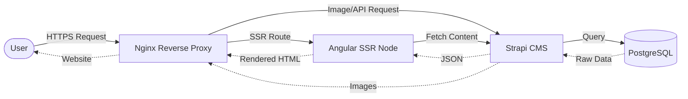

# 🎃 Little Pumpkin Design – Fullstack Portfolio


🌐 **Live Demo:** [littlepumpkindesign.de](https://littlepumpkindesign.de)

> **Welcome to the source code of my personal portfolio!** > This repository showcases a modern, next-gen fullstack architecture, combining a highly scalable frontend with a headless CMS, entirely containerized and self-hosted.

## ✨ Key Features & Technical Highlights

This project is built to reflect enterprise-level standards in web development:

* **Server-Side Rendering (SSR):** Optimized for flawless SEO and lightning-fast Initial Page Loads using the latest Angular features.
* **Atomic Design Architecture:** Frontend components are strictly separated into Atoms, Molecules, and Organisms for maximum reusability.
* **Headless CMS Integration:** Dynamic content management via Strapi v4 (REST API).
* **Automated CI/CD:** Fully automated build and deployment pipelines using **GitHub Actions** (Push to GitHub Container Registry).
* **Enterprise Security:** Strict Content Security Policies (CSP) with dynamic nonces against XSS attacks, backed by a custom Nginx reverse proxy featuring rigorous file-extension whitelisting.
---

## 🏗️ Architecture & Hosting Strategy

Unlike standard static hosting platforms, the entire stack is architected for self-hosting to maintain full control over data and infrastructure:



* **Infrastructure:** Hosted on a local **Synology NAS** server environment.
* **Orchestration:** Multi-container deployment managed via **Docker Compose**.
* **Routing:** Served via an **Nginx Reverse Proxy** handling routing and SSL/TLS termination.

---

## 🚀 Getting Started (Local Setup)

### Prerequisites

Make sure you have the following installed on your machine:

* [Docker](https://www.docker.com/) & Docker Compose
* Node.js (for local frontend development)

### Installation

**1. Clone the repository:**

```bash
git clone [https://github.com/LittlePumpkin87/pumpkindesign.git](https://github.com/LittlePumpkin87/pumpkindesign.git)
cd pumpkindesign

```

**2. Setup Environment Variables:**
Create your own `.env` file based on the provided example and fill in your secrets:

```bash
cp .env.example .env

```

**3. Spin up the environment:**
Start the entire stack (Frontend + Backend + Database) locally using Docker Compose:

```bash
docker compose --env-file .env -f docker-compose.dev.yml up -d --build --force-recreate

```
or use npm commands for quicker start/build/shutdown containers

```bash
npm run docker start
npm run docker recreate
npm run docker down

```

*(For the production environment, replace `docker-compose.dev.yml` with `docker-compose.yml`.)*

---

## 📁 Project Structure (Frontend Focus)

The Angular frontend follows a highly scalable architecture:

```text
pumpkindesign_ssr/
├── public/                 # Static assets
└── src/
    ├── app/
    │   ├── components/     # Atomic Design Architecture
    │   │   ├── atoms/      # Smallest building blocks (buttons, inputs)
    │   │   ├── molecules/  # Groups of atoms functioning together
    │   │   └── organisms/  # Complex UI components composed of molecules
    │   ├── interfaces/     # TypeScript interfaces and type definitions
    │   ├── mapper/         # Data mappers (API payload to frontend models)
    │   ├── services/       # Core business logic and API communication
    │   └── shared/         # Shared modules and global components
    ├── main.server.ts      # SSR entry point
    └── server.ts           # Express Node server setup (incl. CSP & Proxy)

```

### REST API Endpoints (Strapi)

* `/api/head` - Fetches global Header Data (Favicon, Logo, Navigation).
* `/api/page-by-path?path=/` - Fetches cleaned-up structural data for a specific page route.
* `/api/foot` - Fetches global Footer Data.
* `/api/navigation/render/main?type=TREE` - Fetches global Main navigation.

---

## 🕸️ Feature Spotlight: Interactive Tech-Stack Spiderweb

A hand-built SVG spider web where each skill icon hangs on the strands. Hovering a main skill sends a
glowing line **crawling along the web** to each of its subskills, and the strands physically wobble.
It's a self-contained molecule with no external animation libraries — just a tiny physics loop, a
graph search, and CSS.

**Three cooperating layers:**

1. **Physics** ([`spiderweb.physics.ts`](pumpkindesign_ssr/src/app/components/molecules/spiderweb/spiderweb.physics.ts))
   — a small damped-spring simulation (Hooke's law + damping, semi-implicit Euler). Three body types:
   `ThreadPendulum` (hanging threads), `ThreadChain` (coupled links that whip like a rope), and
   `RockingChain` (pinned endpoints, only the curve bows). No DOM access — each body just turns its
   state into an SVG path string.
2. **Routing** ([`spiderweb.config.ts`](pumpkindesign_ssr/src/app/components/molecules/spiderweb/spiderweb.config.ts))
   — the web geometry is turned into a graph (junctions = nodes, segments = weighted edges).
   `routeSegments()` runs Dijkstra between two icons, so the glow travels *along* the web (hopping
   horizontal arcs) instead of funnelling through the centre. A small per-hover random jitter varies
   near-equal routes for an organic feel.
3. **Crawl render** ([`spiderweb.ts`](pumpkindesign_ssr/src/app/components/molecules/spiderweb/spiderweb.ts) +
   `.scss`/`.html`) — the route is drawn as one continuous line via a sequenced `stroke-dashoffset`
   animation on a separate overlay layer, so the faint base web stays fully visible underneath. A
   `requestAnimationFrame` loop steps the physics and sleeps once everything settles.

**Content model (Strapi `skill`):** editors only set **`connectedPathIds`** — the path id where an
icon hangs (e.g. `subskill-3`). Subskill relations define which skill connects to which, and the glow
route is computed automatically. **`glowPathIds`** is an optional manual override for hand-picked
segments. The path ids are a shared namespace across the SVG template, the config data, and Strapi.

> 💡 **What is Dijkstra?** A classic shortest-path algorithm (Edsger W. Dijkstra, 1959). Given a graph
> of nodes connected by weighted edges, it finds the cheapest route between two nodes by always
> expanding the nearest not-yet-finalized node and updating ("relaxing") its neighbours' distances.
> Here the nodes are web junctions, the edge weights are segment lengths, so the "cheapest route" is
> the shortest path the glow can take *along the web*.

---

## 🛠️ Development Roadmap & To-Dos

This project is under active development. Current focus areas:

* [x] Configure Headless Navigation Structure in Strapi.
* [x] Create and migrate initial Startpage content.
* [x] Fix Docker volume mapping for uploaded Strapi images in production.
* [x] Integrate core backend components.
* [ ] **WIP:** Finalize interactive frontend components for all pages (e.g., Tech-Stack Spiderweb).
* [ ] **WIP:** Build dynamic portfolio case study pages.
* [ ] Populate Strapi with content.

---

## 👩‍💻 About the Developer

I am a professional **Web Developer** currently working in an agency environment, specialized in modern frontend architectures and headless content management workflows.

* **Current Focus:** Angular, TypeScript, Headless CMS integration (Strapi, Webflow, FirstSpirit), and DevOps (Docker, CI/CD Pipelines).
* **Design Background:** With a strong background in Graphic Design, I focus heavily on pixel-perfect UI implementations and seamless UX/UI concepts.

📫 **Get in touch:** Let's connect on [Xing](https://www.xing.com/profile/Jennifer_Roob/web_profiles?nwt_nav=profile) or check out my live portfolio at [littlepumpkindesign.de](https://littlepumpkindesign.de).
