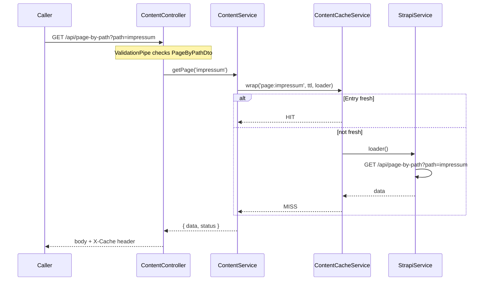
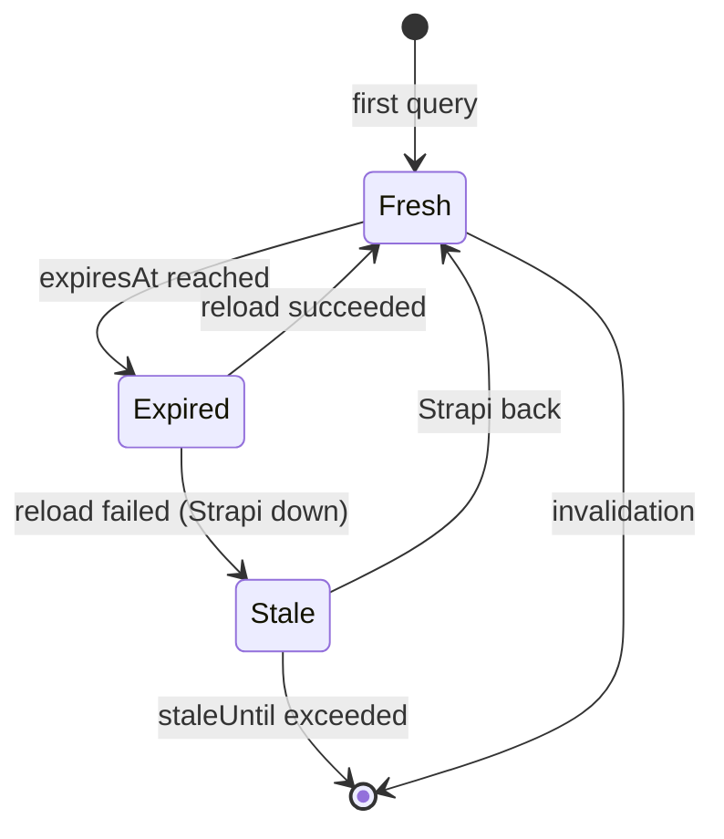
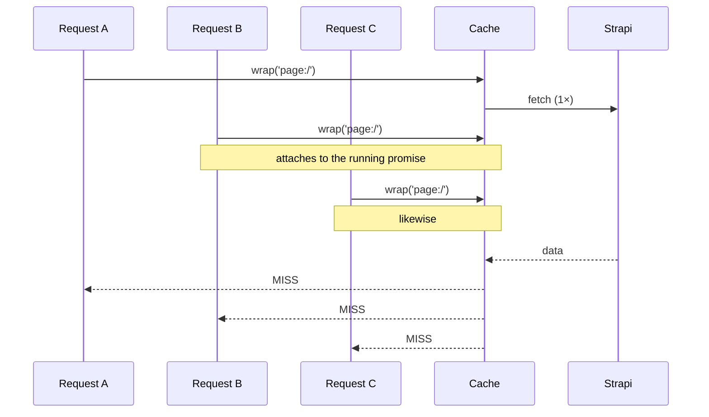

# pumpkin-api — Architecture and decisions

This document explains **what** the service does, **why** it is built this way and
**where the limits** are. It is deliberately more detailed than the
[README](../README.md): that one explains how to operate the service, this one
explains the reasoning.

---

## Contents

1. [Summary](#1-summary)
2. [The problem](#2-the-problem)
3. [The architecture](#3-the-architecture)
4. [The path of a request](#4-the-path-of-a-request)
5. [The four mechanisms](#5-the-four-mechanisms)
6. [NestJS concepts in this project](#6-nestjs-concepts-in-this-project)
7. [Security decisions](#7-security-decisions)
8. [Alternatives deliberately not chosen](#8-alternatives-deliberately-not-chosen)
9. [Known limits](#9-known-limits)
10. [Common questions about the design](#10-common-questions-about-the-design)
11. [Glossary](#11-glossary)

---

## 1. Summary

The website runs on Angular SSR with Strapi as a headless CMS. Every page view
triggered four uncached CMS queries, one of them a recursive deep populate eight
levels down. When Strapi went down, the site went down with it.

`pumpkin-api` is a NestJS service that sits between the SSR server and Strapi and
caches the responses. So that content is still immediately up to date, Strapi
invalidates the cache through a webhook instead of leaving that job to short
expiry times. When Strapi is unreachable, the service keeps serving stale content
rather than showing errors.

---

## 2. The problem

### 2.1 The starting point

The site consisted of two services:

- **Angular 21 SSR** (`pumpkindesign_ssr/`) — pre-renders the page on the server.
- **Strapi 5** (`strapi_pumpkindesign_ssr/`) — headless CMS on PostgreSQL.

Between them sat a hand-written proxy of roughly 25 lines in
[`server.ts`](../../pumpkindesign_ssr/src/server.ts). It attached the Strapi token
to every `/api` request and passed it through.

### 2.2 What hurt about it

**Every page view = four CMS queries.** The three Angular services `PageService`,
`NavigationService` and `FooterService` each ask again on every `NavigationEnd`:

| Call | Purpose |
| --- | --- |
| `/api/page-by-path?path=…` | Page content |
| `/api/head` | Header area |
| `/api/foot` | Footer area |
| `/api/navigation/render/main?type=TREE` | Menu |

**One of them is expensive.** The custom controller
[`router.ts`](../../strapi_pumpkindesign_ssr/src/api/router/controllers/router.ts)
uses `getAutoPopulate()` to build a populate tree recursively down to depth 8, by
iterating over `strapi.contentTypes` and `strapi.components` at runtime. That is
elegant — nothing needs updating when a new CMS component is added — but it
produces a wide database query across the entire component structure of the page
on *every* request.

**No outage protection.** The old proxy had no timeout, no retry and no fallback.
A Strapi restart — during a deployment, for instance — meant visitors saw errors.

**No reuse.** Two visitors opening the same page at the same time triggered two
identical deep-populate queries. Ten visitors: ten.

### 2.3 What was *not* a problem

The site is small, it has few visitors, and it worked. This was not a crisis but an
opportunity to address a real problem with a proportionate solution.

---

## 3. The architecture


Four containers plus the database, all on the same Docker network. `pumpkin_api`
deliberately has **no published port** — it is reachable only from inside.

The dashed arrow is the core of the design: **Strapi reports changes actively**,
instead of the cache having to guess them through expiry.

### 3.1 Why this is not a pointless extra hop

An additional network hop costs latency. That only pays off if the hop saves more
than it costs:

| | Cost | Benefit |
| --- | --- | --- |
| Cache hit | ~0.3 ms hop | the full deep-populate query is avoided |
| Cache miss | ~0.3 ms hop | none |
| Strapi down | ~0.3 ms hop | the site stays online |

At an expected hit rate well above 90 % — content changes rarely, visitors open
the same pages — the arithmetic works out comfortably.

### 3.2 Drop-in as a design principle

The service mirrors Strapi's paths **exactly** and passes response bodies through
**unchanged**. Consequence: switching over is a single environment variable in
`docker-compose.yml`.

```yaml
- BASE_PATH_STRAPI=http://pumpkin_api:3000   # previously: http://strapi:6466
```

No frontend code was touched, and the way back is the same line.

---

## 4. The path of a request

### 4.1 The oddity first

During server rendering the Angular server calls **itself**. That looks like a bug
but is intentional:

Angular resolves relative URLs during SSR against the public origin. The server
process would therefore knock on its own door by way of nginx and the internet.
[`app.config.server.ts`](../../pumpkindesign_ssr/src/app/app.config.server.ts)
overrides the `API_BASE` token with `http://127.0.0.1:${PORT}/api` — the loopback
address of its own Express server.

`HTTP_TRANSFER_CACHE_ORIGIN_MAP` then maps the loopback origin back to the public
one, so that the transfer cache in the browser finds the same keys and the requests
do not run a second time after hydration.

The full chain on a first page view:

```
Browser → nginx → Express (SSR) → Angular HttpClient
                     ↓ 127.0.0.1:4200/api
                  Express proxy → pumpkin_api → Strapi → PostgreSQL
```

### 4.2 Inside pumpkin-api



The header `X-Cache: HIT | MISS | STALE | BYPASS` makes the behaviour visible in
devtools, in the log and in the tests, without having to look inside the process.

---

## 5. The four mechanisms

### 5.1 TTL cache

Every entry carries two timestamps, not one:

```ts
interface CacheEntry<T> {
  data: T;
  expiresAt: number;   // fresh up to this point
  staleUntil: number;  // still usable in an emergency up to this point
}
```

That yields three states:



Defaults: fresh for 1 hour, 24 hours as an emergency reserve. The navigation gets
only 5 minutes — see [5.4](#54-push-invalidation).

### 5.2 Single-flight

**The problem** is called a *cache stampede* or *thundering herd*: the moment an
entry expires, every concurrent request runs into the miss and each one triggers
its own expensive query. The cache amplifies the load instead of damping it —
precisely when traffic is highest.

**The solution:** only one request goes upstream, all others attach themselves to
the same promise.



The core of it in [`content-cache.service.ts`](../src/cache/content-cache.service.ts):

```ts
private load<T>(key: string, ttlMs: number, loader: () => Promise<T>): Promise<T> {
  const existing = this.inFlight.get(key) as Promise<T> | undefined;
  if (existing) {
    return existing;          // attach instead of loading again
  }

  const promise = loader()
    .then((data) => { /* … store … */ return data; })
    .finally(() => { this.inFlight.delete(key); });

  this.inFlight.set(key, promise);
  promise.catch(() => undefined);   // see below
  return promise;
}
```

Two subtleties that are easy to miss:

- **`.finally` instead of `.then`** — the entry has to disappear from `inFlight` on
  failure too, otherwise every subsequent request hangs forever on a rejected
  promise.
- **The empty `promise.catch()`** — Node reports a rejected promise as an
  `unhandledRejection` if nothing attaches a handler within that tick. The empty
  catch only swallows that warning; the real callers still receive the rejection
  through the returned promise.

### 5.3 stale-if-error

The decisive distinction: **"Strapi does not answer"** is something different from
**"Strapi says: does not exist"**.

| Strapi response | Meaning | Reaction |
| --- | --- | --- |
| 2xx | Data | cache it, serve it |
| 4xx | a reliable statement ("page does not exist") | pass through, do *not* cache |
| 5xx, timeout, network error | no statement | retry, then serve the stale entry |

That is why the dedicated error class
[`StrapiUnavailableError`](../src/strapi/strapi-unavailable.error.ts) exists. The
cache checks for it explicitly:

```ts
if (error instanceof StrapiUnavailableError && entry && now < entry.staleUntil) {
  return { data: entry.data, status: 'STALE' };
}
throw error;
```

Without that separation a deleted page would keep being served from the cache — a
404 masked by old data. This is the point where most home-grown caches get it
wrong.

**The follow-on decision:** the `/health` endpoint of **this service** does *not*
check Strapi. If it did, a Strapi outage would mark the pumpkin-api container
unhealthy, Docker would restart it — and the restart would wipe the in-memory
cache, meaning exactly the stale entries that are supposed to be bridging the
outage. The dependency check sits separately on `/health/strapi` and is free to
return 503; it is information, not a trigger.

Not to be confused with Strapi's own `/_health`: that one is called by Strapi's
Docker `HEALTHCHECK` every 30 seconds (hence the regular `204`s in Strapi's log),
and by `StrapiService.ping()` — which is what `/health/strapi` relies on.

This is the difference between **liveness** ("is the process running?") and
**readiness** ("can it reach its dependencies?"). Putting both into one endpoint is
a common mistake.

### 5.4 Push invalidation

**The usual route** is a short TTL: cache for 60 seconds, then reload. That forces
a compromise — a short TTL means little benefit, a long TTL means editors wait for
their own changes.

**The route taken here** reverses the direction: Strapi calls
`POST /api/cache/invalidate` on every change. That allows the TTL to be long
without content going stale — it is only the safety net for a lost webhook.

It is configured in the Strapi admin under *Settings → Webhooks*, without a line of
code in Strapi. The configuration lives in the database, not in the repository —
which is also why the shared secret is not published along with a public repo.

**Why a full flush rather than targeted invalidation?** Because `getAutoPopulate()`
resolves relations down to depth 8. If a shared component changes, that can affect
*any* page. Working out which ones would be guesswork — and a cache that is
sometimes wrong is worse than no cache. The flush is `O(1)`, always correct, and
costs a handful of reloads across roughly two dozen content objects.

**The exception:** the navigation plugin manages its entries outside the normal
content-type lifecycle and does not reliably fire the `entry.*` webhooks. The
navigation tree therefore gets its own short TTL of 5 minutes. That is not an
elegant design but a deliberate crutch around a third-party library.

---

## 6. NestJS concepts in this project

### 6.1 The building blocks

| Concept | What for | Where in the project |
| --- | --- | --- |
| **Module** | bundles related parts, controls visibility through `exports` | `CacheModule`, `ContentModule`, `StrapiModule` |
| **Controller** | maps HTTP routes to methods, contains no logic | [`content.controller.ts`](../src/content/content.controller.ts) |
| **Service (provider)** | the actual logic, testable without HTTP | [`content-cache.service.ts`](../src/cache/content-cache.service.ts) |
| **Guard** | decides before the handler: may this request continue? | [`webhook-secret.guard.ts`](../src/cache/webhook-secret.guard.ts), [`published-only.guard.ts`](../src/common/published-only.guard.ts) |
| **Pipe** | validates and transforms input | global `ValidationPipe` + DTOs |
| **DTO** | describes the expected input as a class with decorators | [`page-by-path.dto.ts`](../src/content/dto/page-by-path.dto.ts) |
| **Interceptor** | wraps the handler, sees both the way in and the way out | [`logging.interceptor.ts`](../src/common/logging.interceptor.ts) |

Not used: **middleware** and **exception filters**. That is not laziness; each has a
concrete reason — and in the second case a known limit as well.

#### Why no middleware

Middleware runs at the very start of the chain, before the guards, and works directly on
the Express objects `req`/`res`. The typical jobs are covered elsewhere here: Nest brings
its own body parsing, nginx handles the security headers and TLS termination, and CORS is
a non-issue because the only client is the SSR container on the same Docker network — the
browser never talks to this service directly.

That leaves the one candidate where middleware would be the obvious choice: request
logging. Using an interceptor instead is a deliberate decision. The log line contains
`cache=HIT|MISS|STALE`, and that header is only set by the controller. Middleware runs
*before* the handler; it would have to hook into `res.on('finish')` to see the header at
all — outside Nest's execution context, with manual timing. An interceptor wraps the
handler, sees both directions, and gets duration and cache status without detours.

> The general rule behind it: middleware is right as long as only the *incoming* request
> matters. As soon as the handler's result plays a role, the interceptor is the
> appropriate layer.

#### Why no exception filter

Nest already has a global exception filter built in, and it does exactly the right thing —
provided the right errors are thrown. The code is built for that: on a 4xx, `StrapiService`
deliberately throws an `HttpException` carrying Strapi's status code, so the built-in
filter passes it through unchanged. A custom filter would only rebuild what already works.
The same goes for the `ValidationPipe` (400) and the guards (401, 403, 405).

**The exception that is still open.** `StrapiUnavailableError` is a plain `Error` class and
is never translated into a status. If Strapi is unreachable *and* no entry is inside the
stale window, the built-in filter takes over and answers with **500 Internal Server
Error**. Semantically correct would be **503 Service Unavailable**: the service itself is
working perfectly, only its dependency is not. Monitoring cannot distinguish "our fault"
from "upstream is gone", and the case is not covered in the tests.

This is the one place where an exception filter would genuinely contribute something:

```ts
@Catch(StrapiUnavailableError)
export class StrapiUnavailableFilter implements ExceptionFilter { /* → 503 */ }
```

The filter is preferable to the more obvious route of throwing a
`ServiceUnavailableException` in the service already. The knowledge "this error class means
503" is a statement about the HTTP layer; `StrapiService` and `ContentCacheService` should
not need to know anything about HTTP status codes — otherwise they would no longer be
sensibly testable outside an HTTP context.

### 6.2 Dependency injection, concretely

```ts
@Injectable()
export class ContentService {
  constructor(
    private readonly strapi: StrapiService,
    private readonly cache: ContentCacheService,
    config: ConfigService<Env, true>,
  ) {}
}
```

`ContentService` only states *what* it needs — not *where from*. Nest resolves the types
through the DI container and passes in the instances (singletons by default).

The practical gain shows up in tests: there `StrapiService` is replaced by a mock without
`ContentService` noticing.

```ts
const moduleRef = await Test.createTestingModule({
  providers: [
    ContentService,
    ContentCacheService,
    { provide: StrapiService, useValue: strapi },   // mock
    { provide: ConfigService, useValue: config },
  ],
}).compile();
```

That is the concrete benefit of loose coupling: the class stays unchanged, only its
environment is swapped out.

### 6.3 The order of the request lifecycle

```
Request
  → Middleware
  → Guards
  → Interceptors (before the handler)
  → Pipes
  → Route handler
  → Interceptors (after the handler)
  → Exception filter
Response
```

Practical consequence in this project: on the webhook the guards are listed in the order
`ThrottlerGuard, WebhookSecretGuard`. Guards run in exactly that order — so rate limiting
takes effect **before** the secret is checked. The other way round, the secret could be
brute-forced without any throttling.

### 6.4 Configuration that fails at startup

[`env.validation.ts`](../src/config/env.validation.ts) validates the environment against a
Zod schema during boot:

```ts
export const envSchema = z.object({
  BASE_PATH_STRAPI: z.url(),
  STRAPI_API_TOKEN: z.string().min(1),
  STRAPI_WEBHOOK_SECRET: z.string().min(16),
  CACHE_TTL_MS: z.coerce.number().int().min(0).default(3_600_000),
  // …
});
```

Without it a missing token would not surface at deployment time but as a series of 403s
hitting the first visitor. **Fail fast** means the error shows up where it originates.

`z.coerce` is necessary because environment variables are always strings — `"3600000"`
becomes the number `3600000`.

---

## 7. Security decisions

### 7.1 Constant-time comparison

```ts
const actual = createHash('sha256').update(provided).digest();
if (!timingSafeEqual(actual, this.expected)) {
  throw new UnauthorizedException('Invalid X-Webhook-Secret header');
}
```

Two things happen here:

**Why `timingSafeEqual` and not `===`?** An ordinary string comparison stops at the first
differing character. From the runtime differences the secret can in theory be
reconstructed character by character — a *timing attack*. `timingSafeEqual` always takes
the same amount of time.

**Why hash first?** `timingSafeEqual` throws if the buffers have different lengths. That
very difference would reveal the length of the secret. After SHA-256 both sides are always
32 bytes.

For perspective: for an endpoint whose worst possible abuse is flushing the cache, this
effort is more than necessary. But it costs nothing and makes the rule general — in case
the endpoint gains more powers later.

### 7.2 Rate limiting only where it helps

The reflex would be a global `APP_GUARD` with a throttler. Here that would be
counterproductive: in production **all** traffic comes from a single IP — the SSR
container. An IP-based limit would throttle the entire site during a traffic spike. The
throttler is therefore attached to the webhook only.

A security measure taken without regard to the network topology easily turns into
self-harm.

### 7.3 No write paths

The passthrough fallback answers anything other than `GET` with **405 Method Not
Allowed**. The old proxy forwarded writes — but without the request body, because it never
read it. A silent, broken write path is more dangerous than none at all.

### 7.4 Published content only

A Strapi API token of type "read-only" is allowed to **read drafts**. Since the
passthrough forwards raw query strings, unpublished work would have been one parameter
away from the public: `GET /api/pages?status=draft` — demonstrated on the production site.

`PublishedOnlyGuard` rejects exactly that request with a 403. Blocking the *explicit*
request is enough: without a parameter, Strapi only ever returns published content
anyway. The alternative — forcing `status=published` — would have meant attaching the
parameter to plugin routes that do not understand it either.

**The genuinely interesting part is the bypass the test uncovered.** Express 5 parses query
strings with the "simple" parser by default, Strapi uses `qs` in "extended" mode. For
`?status[0]=draft` that means:

| | View of the request |
| --- | --- |
| Express 5 (simple) | key `"status[0]"`, no `status` → the guard sees nothing |
| Strapi (qs extended) | `status: ['draft']` → the draft is served |

This is a **parser discrepancy**: two components read the same bytes differently, and the
check grasps at nothing. The fix is not to catch more special cases but to align the
parsers — `app.set('query parser', 'extended')` in [`app.setup.ts`](../src/app.setup.ts).

The principle behind it: **a check has to see the request the way its recipient sees it.**
Otherwise it validates something other than what it protects.

The rule can only be switched off through `ALLOW_DRAFT_ACCESS=true`, and that environment
variable is deliberately *not* declared with `z.coerce.boolean()` — that would turn the
string `"false"` into `true` and quietly open this particular door.

### 7.5 Input validation

The `path` parameter is validated against a DTO and encoded with `encodeURIComponent` when
forwarded. Previously it was interpolated into the URL raw, in the frontend.

The validation was too strict at first and blocked every subpage — see
[section 9.6](#96-the-validation-was-too-strict-at-first).

---

## 8. Alternatives deliberately not chosen

### 8.1 Why not Redis?

The site comprises roughly two dozen content objects in a single process on a NAS. Redis
would mean: one more container, one more backup concern, one more source of failure — for
data that can be reconstructed from Strapi at any time. A cold start costs one reload per
key.

Switching becomes worthwhile as soon as more than one instance runs. A `Map` is
process-local; with two containers each would have its own cache, and an invalidation
would reach only one of them.

### 8.2 Why not an nginx proxy cache?

This is the strongest alternative. nginx can do most of it:

| Mechanism | nginx equivalent |
| --- | --- |
| TTL cache | `proxy_cache_path` + `proxy_cache_valid` |
| Single-flight | `proxy_cache_lock on;` |
| stale-if-error | `proxy_cache_use_stale error timeout http_500;` |

The arguments against:

1. **Targeted invalidation is missing.** `proxy_cache_purge` lives in nginx Plus or in the
   `ngx_cache_purge` module — the `nginx:alpine` image contains neither. Without purge only
   the short TTL would remain, which is exactly the compromise the design sets out to
   avoid.
2. ~~**The configuration lives outside the repository.**~~ *(superseded)* That was true at
   the time of the decision: `nginx.conf` lived only under `${CONFIG_PATH}` on the NAS. It
   is now versioned in the repository, and the pipeline transfers it to the NAS on change
   and reloads nginx without downtime. The mount still points at `${CONFIG_PATH}`, because
   the deploy runner itself runs in a container and its checkout directory does not exist
   as far as the Docker daemon is concerned.
3. ~~**No tests.**~~ *(superseded)* That no longer holds either: the configuration is
   checked with `nginx -t` against the running proxy before every transfer, and routing as
   well as blocklists can be exercised automatically with an nginx container and
   responding dummy backends.
4. **The learning purpose.** The project was meant to demonstrate NestJS — a legitimate
   reason, as long as it is named as one.

Without point 1, nginx would have been sufficient for this use case — and now that points
2 and 3 have fallen away, the decision rests on point 1 and the learning purpose alone.
That is more honest than the original list and changes nothing about the outcome: without
targeted invalidation only the short TTL would remain.

### 8.3 Why not static prerendering (SSG)?

It would actually be the obvious choice for this site — the content changes rarely. Two
arguments against:

- The routes are only known at runtime; they come from the Strapi navigation tree.
  `app.routes.server.ts` uses `RenderMode.Server` throughout.
- Every content change would require a rebuild and a deployment. For a site maintained by
  one person, that is more friction than benefit.

A cache is essentially prerendering that invalidates itself.

### 8.4 Why not a CDN?

nginx already serves static assets with a `max-age` of one year. The API responses are the
actual problem, and a CDN caches those with the same invalidation questions — only outside
one's own control. For a site with a German audience on a NAS in Germany, geography is not
the bottleneck.

### 8.5 Why not a Strapi plugin?

The cache could have been built as Strapi middleware. The argument against: it would then
have lived inside the very process that can fail — the outage protection would have failed
along with it. It also mixes CMS responsibility with delivery.

---

## 9. Known limits

### 9.1 A single instance only

The cache lives in a `Map` in process memory. Horizontal scaling is not possible: two
instances would have separate caches, and the webhook would reach only one. The solution
would be Redis as shared storage — unnecessary for a site on a NAS.

### 9.2 The cache is empty after every restart

No persistence, no warm-up. After a deployment the first call to every page is a miss. At
this scale that is irrelevant; a warm-up at startup would be an obvious extension.

### 9.3 No eviction strategy

Entries are never removed, only overwritten or flushed wholesale. Expired entries keep
occupying memory until the next flush.

That is acceptable because only **successful** responses are stored — errors never enter
the cache, so an attacker cannot fill memory through invented paths. With thousands of real
pages it would need LRU eviction with an upper bound.

### 9.4 No stale-while-revalidate

Only *stale-if-error* is implemented: stale data is served exclusively during a failure.
The related mechanism *stale-while-revalidate* would serve the old value immediately on
expiry and reload in the background — the user never waits. That would be the next
sensible step.

### 9.5 Time is not injectable

`Date.now()` is called directly. The tests work around it with
`jest.spyOn(Date, 'now')`. Cleaner would be an injected `Clock` abstraction — more testable
and without a global intervention.

While writing those tests the corresponding trap showed up immediately:

```ts
jest.spyOn(Date, 'now').mockReturnValue(Date.now() + 61_000);
```

The argument is evaluated *after* `spyOn` has already replaced `Date.now` — the inner call
returns `undefined`, and `undefined + 61000` is `NaN`. The test failed with a thoroughly
misleading message. The target timestamp has to go into a variable first.

### 9.6 The validation was too strict at first

The most instructive mistake of the project. The DTO required a leading slash in `path` —
because that is what paths look like. In fact `PageService.getApiPathFromUrl()` sends the
route segments **without** a leading slash (`impressum`, `blog/artikel`) and only a `/` for
the home page. Strapi filters on exactly that string with `$eq`.

Result: the home page worked, every subpage returned a 400.

The uncomfortable part: the E2E test checked `'kontakt'` **explicitly as invalid**. The
test did not refute the wrong assumption, it cemented it. A test that comes from the same
guess as the code tests nothing.

The lesson: for a drop-in replacement, the contract is read off the **existing caller**,
not off what sounds reasonable.

### 9.7 No Prometheus, no tracing

`/metrics` returns plain JSON that you read by hand. For a single container on a NAS with
no scraper that is proportionate; in a real operating environment Prometheus format and
tracing through request IDs would be required.

### 9.8 The benefit is plausible, not measured

The arithmetic in [3.1](#31-why-this-is-not-a-pointless-extra-hop) rests on an estimate,
not on measurements. `/metrics` provides the hit rate in production, but a dependable
statement about latency under load would need a load test with k6 or similar.

---

## 10. Common questions about the design

**Why a separate service and not this logic inside the Angular server?**
It would be possible — the SSR server is already a BFF. The argument against: the cache
would disappear with every frontend deployment, and the SSR process would take on a second,
unrelated responsibility. Kept separate, each part can restart independently.

**What happens if the webhook is lost?**
Nothing dramatic. The TTL acts as a safety net; after an hour at the latest the content is
current. Push invalidation is an optimisation, not a prerequisite for correctness.

**How is it ensured that errors are never cached?**
Storing happens only in the `.then` branch, so only on success. 4xx responses are passed
through as an `HttpException`, 5xx are handled as `StrapiUnavailableError` — neither ever
reaches the storage path.

**What is the difference between a guard, a pipe and an interceptor?**
The guard decides about access and runs first. The pipe validates and transforms the input
directly before the handler. The interceptor wraps the handler and sees both directions —
used here for logging.

**Why is the passthrough controller the last module?**
Its wildcard `*splat` matches everything. Registered earlier, it would swallow the explicit
routes — including the webhook endpoint. An E2E test checks exactly that by expecting a 401
rather than a 405.

**How was stale delivery tested?**
In the E2E test `StrapiService` is replaced with a mock that throws
`StrapiUnavailableError` after the first successful call, and the clock is moved past the
TTL. The expectation is a 200 with `X-Cache: STALE`. Manually: `docker stop strapi_prod`,
the site keeps loading.

**What would be the next step?**
Stale-while-revalidate, so that even the first call after expiry does not wait. After that
an injectable `Clock` and a warm-up of the most important pages at startup.

**What does it gain, measurably?**
The hit rate can be read from `/metrics` in production. An important caveat: in a cold
state the service is *slower* than direct access, because the extra hop costs latency. The
gain only appears in a warm state — and when Strapi goes down.

---

## 11. Glossary

| Term | Meaning |
| --- | --- |
| **BFF** (backend for frontend) | A server layer tailored to exactly one frontend — bundles calls, hides credentials |
| **TTL** (time to live) | The period for which an entry counts as fresh |
| **Cache stampede / thundering herd** | Many concurrent misses on the same key trigger many identical expensive queries |
| **Single-flight** | The remedy: only one query runs, all others attach to it |
| **stale-if-error** | Serve stale data when the source is unreachable |
| **stale-while-revalidate** | Serve stale data immediately and refresh in the background (*not* implemented here) |
| **Push invalidation** | The source reports changes actively instead of the cache guessing them through expiry |
| **Liveness / readiness** | "Is the process running?" versus "can it reach its dependencies?" |
| **DI** (dependency injection) | Dependencies are handed in from outside rather than created internally — the basis for substitution in tests |
| **DTO** (data transfer object) | A class describing an expected input or output |
| **Timing attack** | Inferring a secret from runtime differences during comparison |
| **Parser discrepancy** | Two components read the same input differently — a check then grasps at nothing |
| **Deep populate** | Recursively loading nested relations in Strapi |
| **Drop-in** | A replacement that serves the same interface and can be swapped in without changing the caller |
