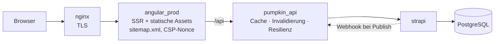
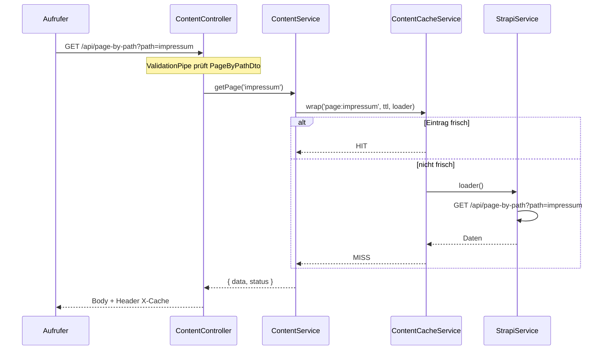
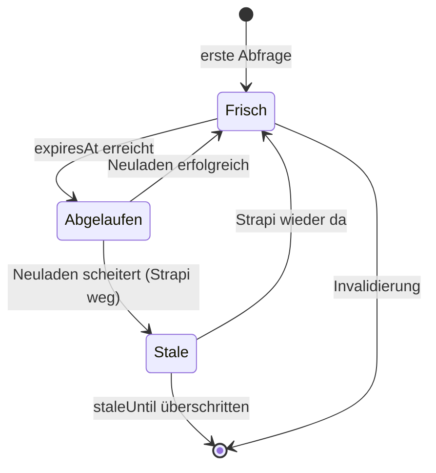
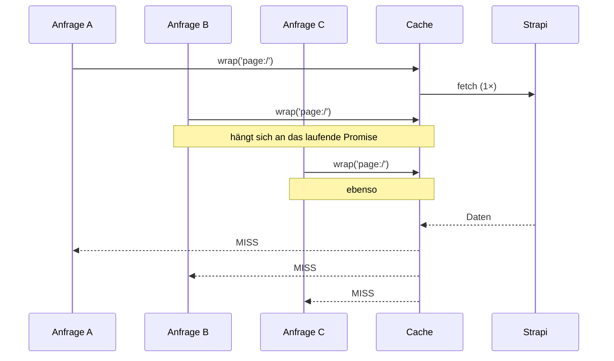

# pumpkin-api — Architektur und Entscheidungen

Dieses Dokument erklärt, **was** der Service macht, **warum** er so gebaut ist und
**wo die Grenzen** liegen. Es ist bewusst ausführlicher als die
[README](../README.md): die erklärt die Bedienung, das hier erklärt die Denkweise.

---

## Inhalt

1. [Kurzfassung](#1-kurzfassung)
2. [Das Problem](#2-das-problem)
3. [Die Architektur](#3-die-architektur)
4. [Der Weg eines Requests](#4-der-weg-eines-requests)
5. [Die vier Mechanismen](#5-die-vier-mechanismen)
6. [NestJS-Konzepte in diesem Projekt](#6-nestjs-konzepte-in-diesem-projekt)
7. [Sicherheitsentscheidungen](#7-sicherheitsentscheidungen)
8. [Bewusst nicht gewählte Alternativen](#8-bewusst-nicht-gewählte-alternativen)
9. [Bekannte Grenzen](#9-bekannte-grenzen)
10. [Häufige Fragen zum Entwurf](#10-häufige-fragen-zum-entwurf)
11. [Glossar](#11-glossar)

---

## 1. Kurzfassung

Die Website läuft auf Angular SSR mit Strapi als Headless CMS. Jeder Seitenaufruf
löste vier ungecachte CMS-Abfragen aus, davon eine mit rekursivem Deep-Populate
über acht Ebenen. Fiel Strapi aus, fiel die Seite mit aus.

`pumpkin-api` ist ein NestJS-Service, der zwischen SSR-Server und Strapi sitzt und
die Antworten cached. Damit Inhalte trotzdem sofort aktuell sind, invalidiert
Strapi den Cache per Webhook, statt dass kurze Ablaufzeiten das erledigen müssten.
Ist Strapi nicht erreichbar, liefert der Service veraltete Inhalte weiter aus,
statt Fehler zu zeigen.

---

## 2. Das Problem

### 2.1 Der Ausgangszustand

Die Seite bestand aus zwei Diensten:

- **Angular 21 SSR** (`pumpkindesign_ssr/`) — rendert die Seite auf dem Server vor.
- **Strapi 5** (`strapi_pumpkindesign_ssr/`) — Headless CMS auf PostgreSQL.

Dazwischen lag ein handgeschriebener Proxy von etwa 25 Zeilen in
[`server.ts`](../../pumpkindesign_ssr/src/server.ts). Der hängte an jeden
`/api`-Request den Strapi-Token und reichte ihn durch.

### 2.2 Was daran wehtat

**Jeder Seitenaufruf = vier CMS-Abfragen.** Die drei Angular-Services
`PageService`, `NavigationService` und `FooterService` fragen bei jedem
`NavigationEnd` neu an:

| Aufruf | Zweck |
| --- | --- |
| `/api/page-by-path?path=…` | Seiteninhalt |
| `/api/head` | Kopfbereich |
| `/api/foot` | Fußbereich |
| `/api/navigation/render/main?type=TREE` | Menü |

**Eine davon ist teuer.** Der Custom-Controller
[`router.ts`](../../strapi_pumpkindesign_ssr/src/api/router/controllers/router.ts)
baut mit `getAutoPopulate()` rekursiv einen Populate-Baum bis Tiefe 8 auf, indem er
zur Laufzeit über `strapi.contentTypes` und `strapi.components` iteriert. Das ist
elegant — man muss beim Anlegen einer neuen CMS-Komponente nichts nachziehen —
aber es erzeugt bei *jedem* Request eine breite Datenbankabfrage über die gesamte
Komponentenstruktur der Seite.

**Kein Ausfallschutz.** Der alte Proxy hatte kein Timeout, keinen Retry und keinen
Fallback. Ein Strapi-Neustart — etwa beim Deployment — hieß: Besucher sehen Fehler.

**Keine Wiederverwendung.** Zwei Besucher, die dieselbe Seite gleichzeitig
aufrufen, lösten zwei identische Deep-Populate-Abfragen aus. Zehn Besucher: zehn.

### 2.3 Was *kein* Problem war

Die Seite ist klein, sie hat wenige Besucher, und sie funktionierte. Das war keine
Krise, sondern eine Gelegenheit, ein reales Problem mit einer angemessenen Lösung
anzugehen.

---

## 3. Die Architektur



Vier Container plus Datenbank, alle im selben Docker-Netz. `pumpkin_api` hat
bewusst **keinen veröffentlichten Port** — erreichbar nur von innen.

Der gestrichelte Pfeil ist der Kern des Entwurfs: **Strapi meldet Änderungen
aktiv**, statt dass der Cache sie durch Ablaufen erraten muss.

### 3.1 Warum das kein sinnloser Zwischen-Hop ist

Ein zusätzlicher Netzwerk-Hop kostet Latenz. Das rechnet sich nur, wenn der Hop
mehr einspart, als er kostet:

| | Kosten | Nutzen |
| --- | --- | --- |
| Cache-Treffer | ~0,3 ms Hop | vollständige Deep-Populate-Abfrage entfällt |
| Cache-Fehltreffer | ~0,3 ms Hop | keiner |
| Strapi weg | ~0,3 ms Hop | Seite bleibt online |

Bei einer erwarteten Trefferquote weit über 90 % — Inhalte ändern sich selten,
Besucher rufen dieselben Seiten auf — geht die Rechnung deutlich auf.

### 3.2 Drop-in als Designprinzip

Der Service spiegelt Strapis Pfade **exakt** und reicht Antwortkörper
**unverändert** durch. Folge: der Wechsel ist eine einzige Umgebungsvariable in
der `docker-compose.yml`.

```yaml
- BASE_PATH_STRAPI=http://pumpkin_api:3000   # vorher: http://strapi:6466
```

Kein Frontend-Code wurde angefasst, und der Rückweg ist dieselbe Zeile.

---

## 4. Der Weg eines Requests

### 4.1 Die Kuriosität vorweg

Beim Server-Rendering ruft der Angular-Server **sich selbst** auf. Das sieht nach
einem Fehler aus, ist aber Absicht:

Angular löst relative URLs beim SSR gegen die öffentliche Origin auf. Der
Serverprozess würde also über nginx und das Internet bei sich selbst anklopfen.
[`app.config.server.ts`](../../pumpkindesign_ssr/src/app/app.config.server.ts)
überschreibt den `API_BASE`-Token deshalb mit `http://127.0.0.1:${PORT}/api` —
die Loopback-Adresse des eigenen Express-Servers.

`HTTP_TRANSFER_CACHE_ORIGIN_MAP` bildet die Loopback-Origin danach wieder auf die
öffentliche ab, damit der Transfer-Cache im Browser dieselben Schlüssel findet und
die Anfragen nach der Hydration nicht ein zweites Mal laufen.

Die vollständige Kette beim ersten Seitenaufruf:

```
Browser → nginx → Express (SSR) → Angular HttpClient
                     ↓ 127.0.0.1:4200/api
                  Express-Proxy → pumpkin_api → Strapi → PostgreSQL
```

### 4.2 Innerhalb von pumpkin-api



Der Header `X-Cache: HIT | MISS | STALE | BYPASS` macht das Verhalten in den
Devtools, im Log und in den Tests sichtbar, ohne dass man in den Prozess schauen
muss.

---

## 5. Die vier Mechanismen

### 5.1 TTL-Cache

Jeder Eintrag hat zwei Zeitstempel, nicht einen:

```ts
interface CacheEntry<T> {
  data: T;
  expiresAt: number;   // bis hierhin frisch
  staleUntil: number;  // bis hierhin im Notfall noch brauchbar
}
```

Daraus ergeben sich drei Zustände:



Standardwerte: 1 Stunde frisch, 24 Stunden als Notreserve. Die Navigation bekommt
nur 5 Minuten — dazu in [5.4](#54-push-invalidierung).

### 5.2 Single-Flight

**Das Problem** heißt *Cache Stampede* oder *Thundering Herd*: In dem Moment, in
dem ein Eintrag abläuft, laufen alle gleichzeitigen Anfragen in den Fehltreffer und
lösen jede eine eigene teure Abfrage aus. Der Cache verstärkt die Last, statt sie
zu dämpfen — genau dann, wenn am meisten los ist.

**Die Lösung:** Es geht nur eine Anfrage nach oben, alle anderen hängen sich an
dasselbe Promise.



Der Kern in [`content-cache.service.ts`](../src/cache/content-cache.service.ts):

```ts
private load<T>(key: string, ttlMs: number, loader: () => Promise<T>): Promise<T> {
  const existing = this.inFlight.get(key) as Promise<T> | undefined;
  if (existing) {
    return existing;          // anhängen statt neu laden
  }

  const promise = loader()
    .then((data) => { /* … speichern … */ return data; })
    .finally(() => { this.inFlight.delete(key); });

  this.inFlight.set(key, promise);
  promise.catch(() => undefined);   // siehe unten
  return promise;
}
```

Zwei Feinheiten, die leicht übersehen werden:

- **`.finally` statt `.then`** — der Eintrag muss auch bei einem Fehler aus
  `inFlight` verschwinden, sonst hängen alle folgenden Anfragen ewig an einem
  gescheiterten Promise.
- **Das leere `promise.catch()`** — Node meldet eine abgelehnte Promise als
  `unhandledRejection`, wenn in dem Tick niemand einen Handler dranhängt. Der
  leere Catch fängt nur diese Warnung ab; die echten Aufrufer bekommen die
  Ablehnung weiterhin über das zurückgegebene Promise.

### 5.3 stale-if-error

Die entscheidende Unterscheidung: **„Strapi antwortet nicht"** ist etwas anderes
als **„Strapi sagt: gibt's nicht"**.

| Strapi-Antwort | Bedeutung | Reaktion |
| --- | --- | --- |
| 2xx | Daten | cachen, ausliefern |
| 4xx | verlässliche Aussage („Seite existiert nicht") | durchreichen, *nicht* cachen |
| 5xx, Timeout, Netzwerkfehler | keine Aussage | Retry, dann veralteten Eintrag ausliefern |

Deshalb gibt es die eigene Fehlerklasse
[`StrapiUnavailableError`](../src/strapi/strapi-unavailable.error.ts). Der Cache
prüft explizit auf sie:

```ts
if (error instanceof StrapiUnavailableError && entry && now < entry.staleUntil) {
  return { data: entry.data, status: 'STALE' };
}
throw error;
```

Ohne diese Trennung würde eine gelöschte Seite weiterhin aus dem Cache
ausgeliefert — ein 404 wäre durch alte Daten überdeckt. Das ist der Punkt, an dem
die meisten selbstgebauten Caches falsch liegen.

**Die Folgeentscheidung:** `/health` prüft Strapi *nicht*. Täte es das, würde ein
Strapi-Ausfall den Container als unhealthy markieren, Docker startet ihn neu — und
der Neustart löscht den In-Memory-Cache, also genau die veralteten Einträge, die
den Ausfall gerade überbrücken sollten. Die Abhängigkeitsprüfung liegt separat auf
`/health/strapi` und darf ruhig 503 liefern; sie ist Information, kein Auslöser.

Das ist der Unterschied zwischen **Liveness** („läuft der Prozess?") und
**Readiness** („kann er seine Abhängigkeiten erreichen?"). Beides in einen
Endpunkt zu legen ist ein verbreiteter Fehler.

### 5.4 Push-Invalidierung

**Der übliche Weg** ist eine kurze TTL: Cache 60 Sekunden, dann neu laden. Das
erzwingt einen Kompromiss — kurze TTL heißt wenig Nutzen, lange TTL heißt, dass
Redakteurinnen auf ihre eigenen Änderungen warten.

**Der Weg hier** dreht die Richtung um: Strapi ruft bei jeder Änderung
`POST /api/cache/invalidate` auf. Dadurch darf die TTL lang sein, ohne dass
Inhalte veralten — sie ist nur noch das Sicherheitsnetz, falls ein Webhook
verlorengeht.

Konfiguriert wird das im Strapi-Admin unter *Settings → Webhooks*, ohne eine Zeile
Code in Strapi. Die Konfiguration liegt in der Datenbank, nicht im Repository —
weshalb das gemeinsame Geheimnis auch bei einem öffentlichen Repo nicht
mitveröffentlicht wird.

**Warum ein kompletter Flush und keine gezielte Invalidierung?** Weil
`getAutoPopulate()` Relationen bis Tiefe 8 auflöst. Ändert sich eine gemeinsam
genutzte Komponente, kann das *jede* Seite betreffen. Zu bestimmen, welche, wäre
Raterei — und ein Cache, der manchmal falsch liegt, ist schlimmer als keiner. Der
Flush ist `O(1)`, immer korrekt, und kostet bei knapp zwei Dutzend Inhaltsobjekten
ein paar Nachladevorgänge.

**Die Ausnahme:** Das Navigation-Plugin verwaltet seine Einträge außerhalb des
normalen Content-Type-Lebenszyklus und löst die `entry.*`-Webhooks nicht
zuverlässig aus. Deshalb bekommt der Navigationsbaum eine eigene, kurze TTL von
5 Minuten. Das ist kein eleganter Entwurf, sondern eine bewusste Krücke um eine
Fremdbibliothek herum.

---

## 6. NestJS-Konzepte in diesem Projekt

### 6.1 Die Bausteine

| Konzept | Wozu | Wo im Projekt |
| --- | --- | --- |
| **Modul** | bündelt zusammengehörige Teile, regelt Sichtbarkeit über `exports` | `CacheModule`, `ContentModule`, `StrapiModule` |
| **Controller** | bildet HTTP-Routen auf Methoden ab, enthält keine Logik | [`content.controller.ts`](../src/content/content.controller.ts) |
| **Service (Provider)** | die eigentliche Logik, testbar ohne HTTP | [`content-cache.service.ts`](../src/cache/content-cache.service.ts) |
| **Guard** | entscheidet vor dem Handler: darf dieser Request weiter? | [`webhook-secret.guard.ts`](../src/cache/webhook-secret.guard.ts), [`published-only.guard.ts`](../src/common/published-only.guard.ts) |
| **Pipe** | validiert und wandelt Eingaben um | globale `ValidationPipe` + DTOs |
| **DTO** | beschreibt die erwartete Eingabe als Klasse mit Dekoratoren | [`page-by-path.dto.ts`](../src/content/dto/page-by-path.dto.ts) |
| **Interceptor** | umschließt den Handler, sieht Ein- und Ausgang | [`logging.interceptor.ts`](../src/common/logging.interceptor.ts) |

Nicht verwendet: Middleware und Exception Filter. Es gab keinen Anlass, und ein
Werkzeug einzusetzen, nur weil das Framework es anbietet, macht den Code nicht
besser.

### 6.2 Dependency Injection, konkret

```ts
@Injectable()
export class ContentService {
  constructor(
    private readonly strapi: StrapiService,
    private readonly cache: ContentCacheService,
    config: ConfigService<Env, true>,
  ) {}
}
```

`ContentService` sagt nur, *was* es braucht — nicht, *woher*. Nest löst die Typen
über den DI-Container auf und übergibt die Instanzen (standardmäßig Singletons).

Der praktische Gewinn zeigt sich im Test: dort wird `StrapiService` durch ein Mock
ersetzt, ohne dass `ContentService` davon etwas merkt.

```ts
const moduleRef = await Test.createTestingModule({
  providers: [
    ContentService,
    ContentCacheService,
    { provide: StrapiService, useValue: strapi },   // Mock
    { provide: ConfigService, useValue: config },
  ],
}).compile();
```

Das ist der konkrete Nutzen loser Kopplung: Die Klasse bleibt unverändert, nur ihre
Umgebung wird ausgetauscht.

### 6.3 Die Reihenfolge im Request-Lebenszyklus

```
Request
  → Middleware
  → Guards
  → Interceptors (vor dem Handler)
  → Pipes
  → Route-Handler
  → Interceptors (nach dem Handler)
  → Exception Filter
Response
```

Praktische Folge in diesem Projekt: Beim Webhook stehen die Guards in der
Reihenfolge `ThrottlerGuard, WebhookSecretGuard`. Guards laufen in genau dieser
Reihenfolge — die Ratenbegrenzung greift also **vor** der Geheimnisprüfung. Wäre
es andersherum, könnte man das Geheimnis ungebremst durchprobieren.

### 6.4 Konfiguration, die beim Start scheitert

[`env.validation.ts`](../src/config/env.validation.ts) prüft die Umgebung mit
einem Zod-Schema beim Hochfahren:

```ts
export const envSchema = z.object({
  BASE_PATH_STRAPI: z.url(),
  STRAPI_API_TOKEN: z.string().min(1),
  STRAPI_WEBHOOK_SECRET: z.string().min(16),
  CACHE_TTL_MS: z.coerce.number().int().min(0).default(3_600_000),
  // …
});
```

Ohne das würde ein fehlender Token nicht beim Deployment auffallen, sondern als
Serie von 403ern beim ersten Besucher. **Fail fast** heißt: der Fehler zeigt sich
dort, wo er entsteht.

`z.coerce` ist nötig, weil Umgebungsvariablen immer Strings sind — `"3600000"`
wird zur Zahl `3600000`.

---

## 7. Sicherheitsentscheidungen

### 7.1 Zeitkonstanter Vergleich

```ts
const actual = createHash('sha256').update(provided).digest();
if (!timingSafeEqual(actual, this.expected)) {
  throw new UnauthorizedException('Invalid X-Webhook-Secret header');
}
```

Zwei Dinge passieren hier:

**Warum `timingSafeEqual` und nicht `===`?** Ein normaler String-Vergleich bricht
beim ersten abweichenden Zeichen ab. Aus den Laufzeitunterschieden lässt sich das
Geheimnis theoretisch Zeichen für Zeichen rekonstruieren — eine *Timing-Attacke*.
`timingSafeEqual` braucht immer gleich lang.

**Warum vorher hashen?** `timingSafeEqual` wirft eine Ausnahme, wenn die Puffer
unterschiedlich lang sind. Genau dieser Unterschied würde die Länge des
Geheimnisses verraten. Nach dem SHA-256 sind beide Seiten immer 32 Byte lang.

Einordnung: Für einen Endpunkt, dessen schlimmster Missbrauch das Leeren des Caches
wäre, ist dieser Aufwand mehr als nötig. Er kostet aber nichts und macht die Regel
allgemein — falls der Endpunkt später mehr kann.

### 7.2 Ratenbegrenzung nur dort, wo sie hilft

Der Reflex wäre ein globaler `APP_GUARD` mit Throttler. Hier wäre das
kontraproduktiv: In Produktion kommt **aller** Traffic von einer einzigen IP — dem
SSR-Container. Ein IP-basiertes Limit würde bei einem Besucheransturm die gesamte
Seite drosseln. Der Throttler hängt deshalb nur am Webhook.

Eine Sicherheitsmaßnahme ohne Blick auf die Netzwerktopologie wird leicht zur
Selbstverletzung.

### 7.3 Keine Schreibpfade

Der Passthrough-Fallback beantwortet alles außer `GET` mit **405 Method Not
Allowed**. Der alte Proxy leitete Schreibzugriffe weiter — allerdings ohne den
Request-Body, weil er ihn nie las. Ein stiller, kaputter Schreibpfad ist
gefährlicher als gar keiner.

### 7.4 Nur veröffentlichte Inhalte

Ein Strapi-API-Token vom Typ „Read-only" darf **Entwürfe lesen**. Da der
Passthrough rohe Query-Strings weiterreicht, wäre unveröffentlichte Arbeit einen
Parameter weit von der Öffentlichkeit entfernt gewesen:
`GET /api/pages?status=draft` — nachgewiesen auf der Produktivseite.

`PublishedOnlyGuard` lehnt genau diese Anfrage mit 403 ab. Es reicht, den
*expliziten* Wunsch zu blockieren: Strapi liefert ohne Parameter ohnehin nur
Veröffentlichtes. Die Alternative — `status=published` erzwingen — hätte bedeutet,
den Parameter auch an Plugin-Routen anzuhängen, die ihn nicht kennen.

**Der eigentlich interessante Teil ist der Bypass, den der Test aufgedeckt hat.**
Express 5 parst Query-Strings standardmäßig mit dem „simple"-Parser, Strapi mit
`qs` im „extended"-Modus. Für `?status[0]=draft` heißt das:

| | Sicht auf den Request |
| --- | --- |
| Express 5 (simple) | Schlüssel `"status[0]"`, kein `status` → Guard sieht nichts |
| Strapi (qs extended) | `status: ['draft']` → Entwurf wird ausgeliefert |

Das ist eine **Parser-Differenz**: Zwei Komponenten lesen dieselben Bytes
unterschiedlich, und die Prüfung greift ins Leere. Die Lösung ist nicht, mehr
Sonderfälle abzufangen, sondern die Parser anzugleichen —
`app.set('query parser', 'extended')` in [`app.setup.ts`](../src/app.setup.ts).

Das Prinzip dahinter: **Eine Prüfung muss den Request so sehen, wie ihr Empfänger
ihn sieht.** Andernfalls prüft sie etwas anderes, als sie schützt.

Abschaltbar ist die Regel nur über `ALLOW_DRAFT_ACCESS=true`, und die
Umgebungsvariable ist bewusst *nicht* mit `z.coerce.boolean()` deklariert — das
würde die Zeichenkette `"false"` zu `true` machen und ausgerechnet diese Tür still
öffnen.

### 7.5 Eingabevalidierung

Der `path`-Parameter wird gegen ein DTO geprüft und beim Weiterreichen mit
`encodeURIComponent` kodiert. Vorher wurde er im Frontend roh in die URL
interpoliert.

Die Validierung war zunächst zu streng und hat alle Unterseiten blockiert — siehe
[Kapitel 9.6](#96-die-validierung-war-erst-zu-streng).

---

## 8. Bewusst nicht gewählte Alternativen

### 8.1 Warum kein Redis?

Die Seite umfasst etwa zwei Dutzend Inhaltsobjekte in einem einzelnen Prozess auf
einer NAS. Redis hieße: ein Container mehr, ein Backup-Thema mehr, eine
Ausfallquelle mehr — für Daten, die jederzeit aus Strapi rekonstruierbar sind. Ein
Kaltstart kostet einen Nachladevorgang pro Schlüssel.

Zu wechseln lohnt sich, sobald mehr als eine Instanz läuft. Eine `Map` ist
prozesslokal; bei zwei Containern hätte jeder seinen eigenen Cache, und eine
Invalidierung erreichte nur einen davon.

### 8.2 Warum kein nginx-Proxy-Cache?

Das ist die stärkste Alternative. nginx kann das meiste davon:

| Mechanismus | nginx-Entsprechung |
| --- | --- |
| TTL-Cache | `proxy_cache_path` + `proxy_cache_valid` |
| Single-Flight | `proxy_cache_lock on;` |
| stale-if-error | `proxy_cache_use_stale error timeout http_500;` |

Die Gründe dagegen:

1. **Gezielte Invalidierung fehlt.** `proxy_cache_purge` steckt in nginx Plus oder
   im Modul `ngx_cache_purge` — im Image `nginx:alpine` ist beides nicht enthalten.
   Ohne Purge bliebe nur die kurze TTL, also genau der Kompromiss, den der Entwurf
   vermeiden soll.
2. ~~**Die Konfiguration liegt außerhalb des Repos.**~~ *(überholt)* Das stimmte
   zum Zeitpunkt der Entscheidung: die `nginx.conf` lag nur unter `${CONFIG_PATH}`
   auf der NAS. Inzwischen liegt sie versioniert im Repository, und die Pipeline
   überträgt sie bei Änderungen auf die NAS und lädt nginx ohne Ausfall neu. Der
   Mount zeigt weiterhin auf `${CONFIG_PATH}`, weil der Deploy-Runner selbst in
   einem Container läuft und sein Checkout-Verzeichnis für den Docker-Daemon
   nicht existiert.
3. ~~**Keine Tests.**~~ *(überholt)* Auch das gilt nicht mehr: die Konfiguration
   wird vor jeder Übertragung mit `nginx -t` gegen den laufenden Proxy geprüft,
   und Routing wie Blocklisten lassen sich mit einem nginx-Container und
   antwortenden Dummy-Backends automatisiert durchspielen.
4. **Der Lernzweck.** Das Projekt sollte NestJS zeigen — ein legitimer Grund,
   solange er benannt wird.

Ohne Punkt 1 hätte nginx für diesen Anwendungsfall ausgereicht — und nachdem die
Punkte 2 und 3 weggefallen sind, trägt die Entscheidung inzwischen allein auf
Punkt 1 und dem Lernzweck. Das ist ehrlicher als die ursprüngliche Aufzählung und
ändert am Ergebnis nichts: ohne gezielte Invalidierung bliebe nur die kurze TTL.

### 8.3 Warum kein statisches Prerendering (SSG)?

Wäre für diese Seite eigentlich naheliegend — der Inhalt ändert sich selten. Zwei
Gründe dagegen:

- Die Routen stehen erst zur Laufzeit fest; sie kommen aus dem
  Strapi-Navigationsbaum. `app.routes.server.ts` nutzt durchgängig
  `RenderMode.Server`.
- Jede Inhaltsänderung bräuchte einen Neubau und ein Deployment. Das ist für eine
  Seite, die von einer Person gepflegt wird, mehr Reibung als Nutzen.

Ein Cache ist im Grunde ein Prerendering, das sich selbst invalidiert.

### 8.4 Warum kein CDN?

Statische Assets liefert nginx bereits mit einem Jahr `max-age` aus. Die
API-Antworten sind das eigentliche Problem, und die cached ein CDN nur mit
denselben Invalidierungsfragen — bloß außerhalb der eigenen Kontrolle. Für eine
Seite mit deutschem Publikum auf einer NAS in Deutschland ist die Geografie kein
Engpass.

### 8.5 Warum kein Strapi-Plugin?

Der Cache hätte auch als Strapi-Middleware entstehen können. Dagegen sprach: Er
hätte dann im selben Prozess gelegen, der ausfallen kann — der Ausfallschutz wäre
mit ausgefallen. Außerdem vermischt es CMS-Verantwortung mit Auslieferung.

---

## 9. Bekannte Grenzen

### 9.1 Nur eine Instanz

Der Cache lebt in einer `Map` im Prozessspeicher. Horizontal skalieren geht nicht:
zwei Instanzen hätten getrennte Caches, und der Webhook erreichte nur eine. Lösung
wäre Redis als gemeinsamer Speicher — für eine Seite auf einer NAS unnötig.

### 9.2 Cache ist nach jedem Neustart leer

Kein Persistieren, kein Aufwärmen. Nach einem Deployment ist der erste Aufruf jeder
Seite ein Fehltreffer. Bei diesem Umfang irrelevant; ein Warm-up beim Start wäre
eine naheliegende Erweiterung.

### 9.3 Keine Verdrängungsstrategie

Einträge werden nie entfernt, nur überschrieben oder komplett geleert. Abgelaufene
Einträge belegen weiter Speicher, bis der nächste Flush kommt.

Das ist vertretbar, weil nur **erfolgreiche** Antworten gespeichert werden — Fehler
landen nie im Cache, ein Angreifer kann den Speicher also nicht über erfundene
Pfade volllaufen lassen. Bei tausenden echten Seiten bräuchte es eine
LRU-Verdrängung mit Obergrenze.

### 9.4 Kein stale-while-revalidate

Implementiert ist nur *stale-if-error*: veraltete Daten gibt es ausschließlich im
Störungsfall. Der verwandte Mechanismus *stale-while-revalidate* würde beim
Ablaufen sofort den alten Wert ausliefern und im Hintergrund neu laden — der Nutzer
wartet nie. Das wäre die nächste sinnvolle Ausbaustufe.

### 9.5 Zeit ist nicht injizierbar

`Date.now()` wird direkt aufgerufen. Die Tests behelfen sich mit
`jest.spyOn(Date, 'now')`. Sauberer wäre eine injizierte `Clock`-Abstraktion —
testbarer und ohne globalen Eingriff.

Beim Schreiben dieser Tests trat die zugehörige Falle prompt auf:

```ts
jest.spyOn(Date, 'now').mockReturnValue(Date.now() + 61_000);
```

Das Argument wird ausgewertet, *nachdem* `spyOn` `Date.now` bereits ersetzt hat —
der innere Aufruf liefert `undefined`, und `undefined + 61000` ist `NaN`. Der Test
schlug mit einer völlig irreführenden Meldung fehl. Der Zielzeitpunkt muss vorher
in eine Variable.

### 9.6 Die Validierung war erst zu streng

Der lehrreichste Fehler des Projekts. Das DTO verlangte einen führenden Slash im
`path` — weil Pfade nun mal so aussehen. Tatsächlich schickt
`PageService.getApiPathFromUrl()` die Route-Segmente **ohne** führenden Slash
(`impressum`, `blog/artikel`) und nur für die Startseite ein `/`. Strapi filtert
mit `$eq` exakt auf diesen String.

Ergebnis: Die Startseite lief, jede Unterseite gab 400 zurück.

Der unangenehme Teil: Der E2E-Test hat `'kontakt'` **explizit als ungültig**
geprüft. Der Test hat die falsche Annahme nicht widerlegt, sondern zementiert. Ein
Test, der aus derselben Vermutung stammt wie der Code, prüft nichts.

Die Lehre: Bei einem Drop-in-Ersatz wird der Vertrag aus dem **bestehenden
Aufrufer** abgelesen, nicht aus dem, was vernünftig klingt.

### 9.7 Kein Prometheus, kein Tracing

`/metrics` liefert schlichtes JSON, das man von Hand liest. Für einen einzelnen
Container auf einer NAS ohne Scraper ist das angemessen; in einer echten
Betriebsumgebung wären Prometheus-Format und Tracing über Request-IDs nötig.

### 9.8 Der Nutzen ist plausibel, nicht gemessen

Die Rechnung in [3.1](#31-warum-das-kein-sinnloser-zwischen-hop-ist) beruht auf
einer Abschätzung, nicht auf Messwerten. `/metrics` liefert im Betrieb die
Trefferquote, aber eine belastbare Aussage über Latenz unter Last bräuchte einen
Lasttest mit k6 oder Ähnlichem.

---

## 10. Häufige Fragen zum Entwurf

**Warum ein eigener Service und nicht direkt im Angular-Server?**
Möglich wäre es — der SSR-Server ist bereits ein BFF. Dagegen sprach: Der Cache
würde bei jedem Frontend-Deployment verschwinden, und der SSR-Prozess bekäme eine
zweite, fachfremde Verantwortung. Getrennt kann jeder Teil unabhängig neu starten.

**Was passiert, wenn der Webhook verlorengeht?**
Nichts Dramatisches. Die TTL greift als Sicherheitsnetz, spätestens nach einer
Stunde ist der Inhalt aktuell. Push-Invalidierung ist eine Optimierung, keine
Voraussetzung für Korrektheit.

**Wie ist sichergestellt, dass keine Fehler gecacht werden?**
Gespeichert wird nur im `.then`-Zweig, also ausschließlich bei Erfolg. 4xx werden
als `HttpException` durchgereicht, 5xx als `StrapiUnavailableError` behandelt —
beide erreichen den Speicherpfad nie.

**Was ist der Unterschied zwischen Guard, Pipe und Interceptor?**
Der Guard entscheidet über Zugang und läuft zuerst. Die Pipe validiert und wandelt
die Eingabe direkt vor dem Handler. Der Interceptor umschließt den Handler und
sieht beide Richtungen — hier für das Logging genutzt.

**Warum ist der Passthrough-Controller das letzte Modul?**
Sein Wildcard `*splat` passt auf alles. Würde er früher registriert, verschluckte
er die expliziten Routen — inklusive des Webhook-Endpunkts. Ein E2E-Test prüft
genau das ab, indem er einen 401 statt eines 405 erwartet.

**Wie wurde die Stale-Auslieferung getestet?**
Im E2E-Test wird `StrapiService` durch ein Mock ersetzt, das nach dem ersten
erfolgreichen Aufruf `StrapiUnavailableError` wirft, und die Uhr über die TTL
hinaus vorgestellt. Erwartet wird 200 mit `X-Cache: STALE`. Manuell:
`docker stop strapi_prod`, Seite lädt weiter.

**Was wäre der nächste Ausbauschritt?**
Stale-while-revalidate, damit auch der erste Aufruf nach Ablauf nicht wartet.
Danach eine injizierbare `Clock` und ein Warm-up der wichtigsten Seiten beim Start.

**Was bringt es messbar?**
Die Trefferquote lässt sich im Betrieb über `/metrics` ablesen. Bei der Einordnung
wichtig: Im kalten Zustand ist der Service *langsamer* als der direkte Zugriff,
weil der zusätzliche Hop Latenz kostet. Der Gewinn entsteht erst im warmen Zustand
— und beim Ausfall von Strapi.

---

## 11. Glossar

| Begriff | Bedeutung |
| --- | --- |
| **BFF** (Backend for Frontend) | Serverschicht, die genau auf ein Frontend zugeschnitten ist — bündelt Aufrufe, verbirgt Zugangsdaten |
| **TTL** (Time To Live) | Zeitspanne, für die ein Eintrag als frisch gilt |
| **Cache Stampede / Thundering Herd** | Viele gleichzeitige Fehltreffer auf denselben Schlüssel lösen viele identische teure Abfragen aus |
| **Single-Flight** | Gegenmittel dazu: nur eine Abfrage läuft, alle anderen hängen sich an |
| **stale-if-error** | Veraltete Daten ausliefern, wenn die Quelle nicht erreichbar ist |
| **stale-while-revalidate** | Veraltete Daten sofort ausliefern und im Hintergrund erneuern (hier *nicht* umgesetzt) |
| **Push-Invalidierung** | Die Quelle meldet Änderungen aktiv, statt dass der Cache sie durch Ablaufen errät |
| **Liveness / Readiness** | „Läuft der Prozess?" gegenüber „Erreicht er seine Abhängigkeiten?" |
| **DI** (Dependency Injection) | Abhängigkeiten werden von außen übergeben statt intern erzeugt — Grundlage für Austauschbarkeit im Test |
| **DTO** (Data Transfer Object) | Klasse, die eine erwartete Ein- oder Ausgabe beschreibt |
| **Timing-Attacke** | Rückschluss auf ein Geheimnis aus Laufzeitunterschieden beim Vergleich |
| **Parser-Differenz** | Zwei Komponenten lesen dieselbe Eingabe unterschiedlich — eine Prüfung greift dann ins Leere |
| **Deep Populate** | Rekursives Nachladen verschachtelter Relationen in Strapi |
| **Drop-in** | Ersatz, der dieselbe Schnittstelle bedient und ohne Anpassung des Aufrufers eingesetzt werden kann |
